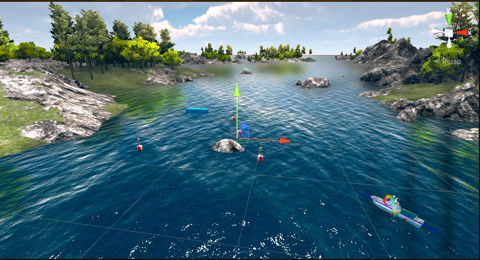

# 第十二届全国海洋航行器设计与制作大赛
## C4智能导航赛道（Maritime-Intelligent-Navigation）
#### 大赛报名网址
 您可以在这里进行大赛报名:[全国海洋航行器设计与制作大赛](http://cmvc.moocollege.com/)
#### 线上开源培训课程链接
 您可以在这里获取线上赛前培训课程：[课程链接](https://www.zhihuishu.com/)，快速上手基于unity的无人艇强化学习导航避障训练环境平台

## Maritime-Intelligent-Navigation仓库简介
* 该仓库是全国海洋航行器设计与制作大赛C4智能导航赛道的仿真环境源代码和文档所在地。
* 支持在unity提供的海洋环境中模拟无人艇导航与避障训练。
* 与全国海洋航行器设计与制作大赛组织者协调设计，该项目提供与现在和未来该项比赛中C4赛道类似的竞技场和任务，可以通过百度网盘链接获取unity平台的仿真环境工程文件。
* 对于C4智能导航的参赛者，此模拟环境旨在作为在物理水上测试之前开发工具原型解决方案的第一步。
 
## Maritime-Intelligent-Navigation平台支撑
   **平台基于 Unity 和 ML-Agents**
* Unity是Unity Technologies公司开发的一款专业的综合型开发引擎，具有强大的跨平台特性与基于物理的 3D 渲染效果。Unity支持多种脚本语言开发,同时具备视觉化编辑、动态预览和实时参数修改的功能，其内置物理引擎可以模拟真实航行环境的物理效果。此外，Unity还支持DRL算法的训练与测试，在构建航行环境和无人艇运动模型方面具有出色的效果。
* ML-Agents是一个开源工具包，用于在Unity环境中进行强化学习和机器学习的研究和开发。它为开发者提供了一套API和工具，可以在Unity中创建智能体（Agents），定义它们的行为和学习算法，并与环境进行交互。使用ML-Agents，可以利用强化学习算法（如Proximal Policy Optimization和Deep Q-Network等）来训练智能体。ML-Agents提供了与TensorFlow和PyTorch等主流机器学习框架的集成，使开发者可以使用自己喜欢的框架来实现算法。

## C4智能导航赛道
* 该环境是第十二届全国海洋航行器设计与制作大赛C4智能导航赛道的仿真环境，您可以访问我们的赛道网址获取最新资讯：[海上智能导航赛道](https://hangxingqi2023.github.io/Maritime-Intelligent-Navigation/)。



## 上手指南
 * [智能导航上手指南](https://hangxingqi2023.github.io/Maritime-Intelligent-Navigation/%E5%BF%AB%E9%80%9F%E4%B8%8A%E6%89%8B%E6%8C%87%E5%8D%97/) 提供文档和教程。
 * 该说明文档进行了详细的解释。如果您从零基础开始，熟悉这些工具，请不用担心，我们的快速上手指南会教会您如何在Unity环境下跑起来自己的无人艇强化学习避障算法
 * 对于技术问题，可以给我们留言描述您的问题或请求支持。


## 加入我们
* 该项目正在积极开发中，以支持全国海洋航行器设计与制作大赛的C4赛道。 我们一直在添加和改进东西。 我们的主要重点是提供无人艇和Unity仿真环境，也欢迎大家围绕他们的特定用例开发额外的功能。

* 如果您对这些主题有任何疑问，或者想在其他方面开展工作，您可以直接联系我们（见下文），也可以提交一个[issue](https://github.com/Hangxingqi2023/Maritime-Intelligent-Navigation/issues))，或者提交一个[pull
 request](https://github.com/Hangxingqi2023/Maritime-Intelligent-Navigation/pulls)！


## 联系我们

 * 加入比赛QQ交流群：xxxx
 * Michael McCarrin <mrmccarr@nps.edu>
 * Brian Bingham <bbingham@nps.edu>
# Virtual RobotX (VRX)
This repository is the home to the source code and software documentation for the VRX simulation environment, which supports simulation of unmanned surface vehicles in marine environments.
* Designed in coordination with RobotX organizers, this project provides arenas and tasks similar to those featured in past and future RobotX competitions, as well as a description of the WAM-V platform.
* For RobotX competitors this simulation environment is intended as a first step toward developing tools prototyping solutions in advance of physical on-water testing.
* We also welcome users with simulation needs beyond RobotX. As we continue to improve the environment, we hope to offer support to a wide range of potential applications.

## Now supporting Gazebo Sim and ROS 2 by default
We're happy to announce with release 2.0 VRX has transitioned from Gazebo Classic to the newer Gazebo simulator (formerly [Ignition Gazebo](https://www.openrobotics.org/blog/2022/4/6/a-new-era-for-gazebo)). 
* Gazebo Garden and ROS 2 are now default prerequisites for VRX.
* This is the recommended configuration for new users.
* Users who wish to continue running Gazebo Classic and ROS 1 can still do so using the `gazebo_classic` branch of this repository. 
  * Tutorials for VRX Classic will remain available on our Wiki.
  * VRX Classic will transition from an officially supported branch to a community supported branch by Spring 2023.

## The VRX Competition
The VRX environment is also the "virtual venue" for the [VRX Competition](https://github.com/osrf/vrx/wiki). Please see our Wiki for tutorials and links to registration and documentation relevant to the virtual competition. 


## Getting Started

 * Watch the [Release 1.5 Highlight Video](https://youtu.be/-2BP2P3CHYw) (Update for release 2.0 coming soon!)
 * The [VRX Wiki](https://github.com/osrf/vrx/wiki) provides documentation and tutorials.
 * The instructions assume a basic familiarity with the ROS environment and Gazebo.  If these tools are new to you, we recommend starting with the excellent [ROS Tutorials](http://wiki.ros.org/ROS/Tutorials)
 * For technical problems, please use the [project issue tracker](https://github.com/osrf/vrx/issues) to describe your problem or request support. 

## Reference

If you use the VRX simulation in your work, please cite our summary publication, [Toward Maritime Robotic Simulation in Gazebo](https://wiki.nps.edu/display/BB/Publications?preview=/1173263776/1173263778/PID6131719.pdf): 

```
@InProceedings{bingham19toward,
  Title                    = {Toward Maritime Robotic Simulation in Gazebo},
  Author                   = {Brian Bingham and Carlos Aguero and Michael McCarrin and Joseph Klamo and Joshua Malia and Kevin Allen and Tyler Lum and Marshall Rawson and Rumman Waqar},
  Booktitle                = {Proceedings of MTS/IEEE OCEANS Conference},
  Year                     = {2019},
  Address                  = {Seattle, WA},
  Month                    = {October}
}
```

## Contributing
This project is under active development to support the VRX and RobotX teams. We are adding and improving things all the time. Our primary focus is to provide the fundamental aspects of the robot and environment, but we rely on the community to develop additional functionality around their particular use cases.

If you have any questions about these topics, or would like to work on other aspects, please contribute.  You can contact us directly (see below), submit an [issue](https://github.com/osrf/vrx/issues) or, better yet, submit a [pull request](https://github.com/osrf/vrx/pulls/)!

## Contributors

We continue to receive important improvements from the community.  We have done our best to document this on our [Contributors Wiki](https://github.com/osrf/vrx/wiki/Contributors).

## Contacts

 * Carlos Agüero <caguero@openrobotics.org>
 * Michael McCarrin <mrmccarr@nps.edu>
 * Brian Bingham <bbingham@nps.edu>
