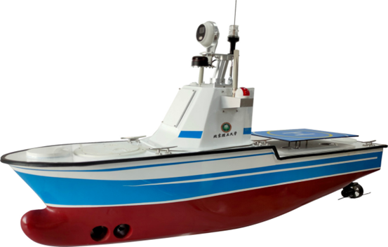
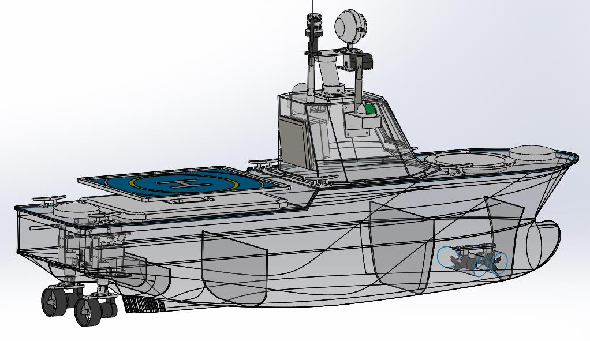

# 第十一届全国海洋航行器设计与制作大赛

# 海上智能导航赛道

##  赛事背景     

​&emsp;&emsp;经过10年发展，全国海洋航行器设计与制作大赛已经是我国船舶与海洋工程领域内层次最高、规模最大、覆盖面最广的国家级大赛。

&emsp;&emsp;随着社会的发展，海上交通运输日渐发达，航运的快速发展也让人们越来越关注船舶的航行安全问题。近年来，船舶碰撞事故的发生频率越来越高，造成了不可估量的人员损失和财产损 失，尤其是恶劣的海况条件给救援任务带来了巨大的阻碍。无人 船平台的出现，为成功实施诸如海事救援、海上测量、危险品监测等特殊任务提供了承载平台，无论在军事上还是民用领域，无人船艇都已有尝试性应用并取得了一定成功。

&emsp;&emsp;未来，无人船艇的应用领域将越来越广泛，逐步扮演更加重要的角色。对于开发者而言，设计平台和结构是相对困难的，于是我们提出智能无人船通用平台Spaitlab-USV180，本设计平台拥有的完善的船体和动力设计方案，已经较好的解决了基本的航行和控制的问题，同时提供了合理的软件架构，方便工作人员进行算法设计。 在船体动力设计，系统架构设计和开发流程方面有着较大的优势，这些优势能够使我们的客户在算法验证，项目研发以及 DIY 设计方面有着强大的支持，可极大的满足客户的二次开发需求。

## Spaitlab-USV180平台简介

&emsp;&emsp;具备强大的动力和巡航系统，能够满足外场实验需求； 船体较大，能够携带更多样的负载，用于满足不同高校实验室的科研要求。 平台主要用作中型实验和应用场景下的数据采集、船体与控制模型研究、避障与决策算法研究、 自主停泊技术研究。 

USV180船型设计

## 大赛时间节点

* `2023.5.17-6.27` - 在大赛网站与竞赛平台完成报名
* `2023.6.28-6.30` - 完成区域赛A榜和B榜竞赛
* `2023.7.22前` - 各区域组织安排区域赛晋级评审
* `2023.7.23-8.15` - 完成国赛A榜竞赛
* `2023.8.12-8.13` - 完成国赛B榜竞赛

  
## 联系我们
	联系方式：。。。。。。
