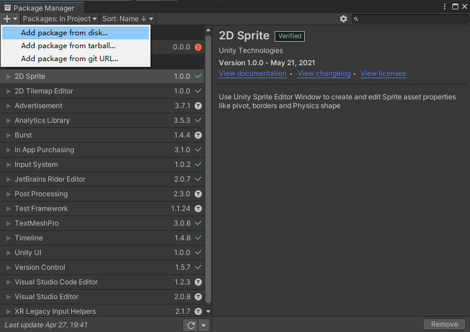
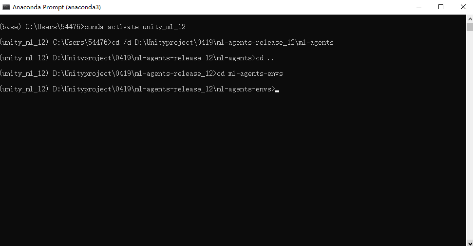
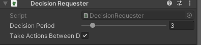
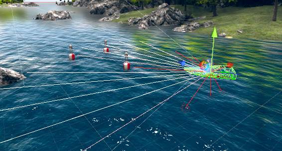
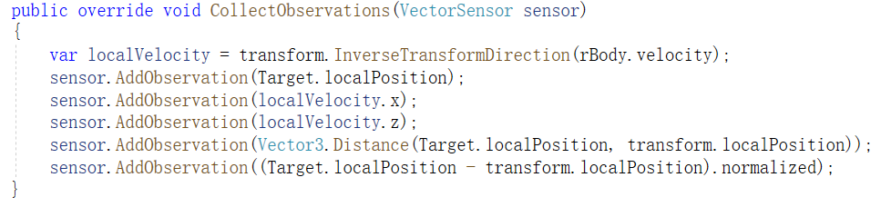
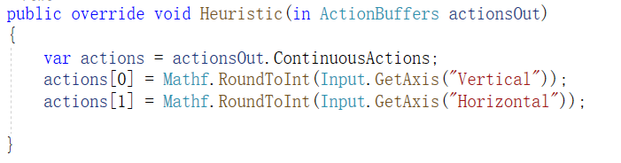
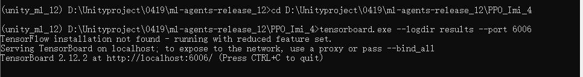
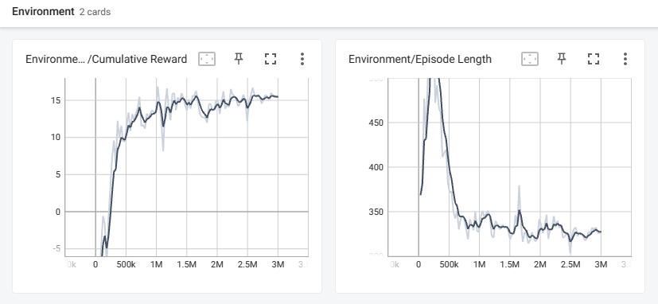
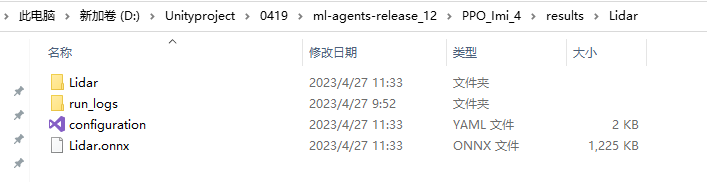

# 平台使用文档

## 1. Unity3D环境搭建

### 1.1 下载UnityHub

+ 官网链接：https://unity.cn/releases


+ 注册账号并登录


+ 申请个人许可证（许可证到期后可免费延期）


### 1.2 下载Unity

+ 从官网中找到版本为2020.3.10f1c1的Unity，选择从Hub下载

### 1.3 加载工程

+ 下载工程文件，链接：

+ 打开UnityHub，点击左上角的**打开**按钮，索引到上一步下载文件的UnmannedShip目录

  

+ 打开过程中会依此弹出以下窗口


选择continue


选择Ignore


&emsp;&emsp;选择No

&emsp;&emsp;进入工程后，选择Window菜单中的Package Manager


&emsp;&emsp;选择左上角加号，单击Add package from disk...



&emsp;&emsp;进入下图所示路径，选择package.json进行导包


## 2. Anaconda环境搭建

### 2.1 下载并安装Anaconda

### 2.2 创建虚拟环境

+ 打开命令行窗口


+ 新建虚拟环境，命令为

```
conda create -n 环境名 python=3.x
```

&emsp;&emsp;环境名可自行设置，最好不要出现中文；python版本建议为3.7（不能设置为3.9）

+ 输入上述命令后按回车键，出现如下画面


+ 按y键进行安装

+ 安装完成后可通过`conda env list`命令查看已有的环境


+ 通过`conda activate 环境名`激活创建的环境

### 2.3 安装Pytorch

+ 官网链接：https://pytorch.org/


+ 如果电脑没有GPU，则安装CPU版本的Pytorch
+ 如果电脑有GPU，可通过`nvidia-smi`命令查看cuda版本，安装对应的Pytorch


### 2.4 安装ML-Agents包

&emsp;&emsp;进入mlagents包的ml-agents-envs目录



&emsp;&emsp;执行如下命令

```
python setup.py install
```

&emsp;&emsp;进入ml-agents目录


&emsp;&emsp;执行如下命令

```
python setup.py install
```

&emsp;&emsp;过程中如果出现，执行如下命令

```
conda install -c anaconda protobuf
```

## 3. ML-Agents训练流程

&emsp;&emsp;**确保已完成按步骤1、2完成了Unity3D和Anaconda环境搭建以及ML-Agents功能包的安装**

### 3.1 概述

&emsp;&emsp;**ML-Agents**是Unity提供的用于强化学习训练的功能包。具体的介绍可查看官方文档：https://github.com/Unity-Technologies/ml-agents

&emsp;&emsp;ML-Agents内置了**PPO**和**SAC**两种强化学习算法和**ICM**、**Imitation**等模块。若使用其内置的算法和模块，只需要编写一个配置文件(.yaml)指定算法的必要参数即可。若使用自己编写的Python代码，可利用ML-Agents提供的接口完成。本文档仅介绍内置算法的使用方法。

### 3.2 强化学习原理

&emsp;&emsp;**强化学习**作为机器学习的一个重要分支，使计算机能够在与环境交互的过程中学习，进而提高自身能力。它所研究的问题是智能体在未知的环境中，如何优化自身的决策、采取最优行为来极大化奖励的期望值。强化学习将世界分为两部分，智能体（Agent）和环境（Environment）。智能体从环境中感知到当前时刻的状态$S_t$和奖励$R_t$，之后根据感知信息进行决策并采取动作$A_t$，动作被执行后影响环境进入下一个状态。智能体继续获得下一时刻的状态$S_{t+1}$和奖励$R_{t+1}$。智能体的目的是获得的奖励尽可能多。在无人艇导航避障问题中，无人艇是唯一的智能体，环境则是有着随机分布的障碍物的水域。无人艇借助传感器对周围物体进行探测，从而观测环境的状态，采取前进和转向完成避障。最大化的奖励对应花费最短的时间或行驶最短的路径到达目的地。


&emsp;&emsp;在强化学习任务中，若正奖励非常少且很难获得则称奖励稀疏。无人艇避障任务中，只有到达目的地才能获得一个正奖励，其余时刻均获得负奖励，属于典型的稀疏奖励。在环境奖励稀疏的情况下，训练智能体是比较困难的：无人艇很少或根本没有到达过目的地，使它误认为已经学到了最优策略，陷入局部最优；无人艇在行为上既不会与障碍物碰撞，又不会到达目的地，也就是发生了迷航。为了改善上述情况，在PPO或SAC的基础上添加**好奇心模块**（Intrinsic Curiosity Module，ICM）。ICM为智能体增加了一个新的奖励函数，这个奖励函数由好奇心驱动，根据智能体是否达到更新奇的状态来给予奖励，目的是促使智能体改进策略保持好奇，进行更多的尝试从而有更大可能获得稀疏奖励。

&emsp;&emsp;**模仿学习**（Imitation Learning，IL）又叫示范学习，顾名思义，在模仿学习中，智能体通过模仿专家的行为来与环境互动。模仿学习可以单独使用，也可以与深度强化学习相结合。在示范的引导下，智能体更易学习到最优策略，从而有效改善了强化学习效率低的问题。模仿学习包含多种方法，下面介绍其中两种。

&emsp;&emsp;（1）行为克隆（Behavioral Cloning，BC）类似于监督学习，将专家的状态-动作对打上标签，智能体只需要在和专家处于相同状态时，采取和专家相同的动作，便完成了学习任务。单纯运用行为克隆很难完成本次学习任务，因此往往将行为克隆作为一个附加模块，和深度强化学习结合使用。

​&emsp;&emsp;（2）生成对抗模仿学习（GAIL）在模仿学习的基础上引入了生成对抗网络（GAN）。GAN包括生成器和判别器。生成器负责将输入根据实际场景转化成语音或文字等对象；判别器负责分辨两个输入对象孰真孰假，并给出一个分数作为评估。在ML-Agents中，可以为智能体提供gail奖励信号。

### 3.3 Unity训练场景

&emsp;&emsp;训练强化学习智能体(Agent)首先需要根据任务需求在Unity中搭建一个训练场景作为强化学习中的环境。在下载的工程中已搭建了一个示例场景。


&emsp;&emsp;从观察器可以看到，场景中包含四个长方体作为围墙，整个训练场的面积为40m×40m。buoy是浮标，作为障碍物，每个回合开始时位置随机。islandCollider为中心的礁石，也是障碍物，位置固定。Target是目标点，为一个蓝色方块，当船与目标点距离足够近时认为到达了目的地。USV180为训练所使用的船体，也是任务中的智能体(Agent)。

&emsp;&emsp;使用ML-Agents训练需要为智能体(Agent)添加必要的控件，具体如下：


+ Behavior Parameters：智能体将接收的策略的参数。该控件是必需的

+ Behavior Name：行为的标识符。具有相同行为名称的智能体将学习相同的策略，需要与配置文件内名称保持一致
+ Vector Observation->Space Size：Agent的矢量观测长度
+ Vector Observation->Stacked Vectors：将被叠加并共同用于决策的先前向量观测的数量。这导致传递给策略的向量观测的有效大小为：空间大小×堆叠向量。
+ Actions->Continuous Actions：智能体执行的连续动作数量
+ Actions->Discrete Branches：智能体执行的离散动作，一个整数数组。数组中的值对应于每个动作分支的离散值数量
+ Model：用于推理的神经网络模型（经过训练后获得）训练时不需要加载，保持None；训练完成后检验效果时加载，同时将Behavior Type选为Inference Only
+ Inference Device：在推理过程中是使用CPU还是GPU来运行模型（建议选择CPU）
+ Behavior Type：智能体的行为类型，确定Agent是执行训练、推理还是使用其Heuristic（）方法。智能体有三种行为：训练、推理和启发。训练指使用Pytorch控制智能体学习；推理指使用加载的神经网络模型；启发指使用Heuristic方法，通过键盘手动控制。当Type选为Default时，如果有Pytorch连接，则为训练行为，否则为推理行为；选为Heuristic Only时，只能手动控制；选为Inference Only时，仅能推理控制。




&emsp;&emsp;该控件用于请求决策，是训练所必需的。


&emsp;&emsp;该控件用于录制模仿学习所需的演示，非必需。

&emsp;&emsp;选中“record”后，无论何时从编辑器运行场景，都会创建一个演示。根据任务的复杂性，可能需要几分钟或几个小时的演示数据才能对模仿学习有用。要指定要录制的确切步骤数，请使用要录制的步骤数字段，一旦录制了那么多步骤，编辑器将自动结束播放会话。如果将要录制的步数设置为0，则录制将继续，直到手动结束播放会话。播放会话结束后，将在指定的文件夹路径中创建一个.demo文件。单击该文件可在检查器中提供有关演示的信息。

&emsp;&emsp;正确的流程是在训练前录制演示（如果希望在训练时添加模仿学习模块），并在配置文件中包含演示文件的路径。在训练开始之前记得禁用演示录制控件，否则会在训练过程中一直进行录制。


&emsp;&emsp;该控件为射线检测，作为智能体观测周围环境的一种方式，类似于激光雷达。




+ Detectable Tags：射线可识别的物体类型（标签）。需要提前为对应的物体添加标签。
+ Rays Per Direction：每个方向上的射线条数
+ Max Ray Degrees：射线角度
+ Ray Length：射线长度

&emsp;&emsp;智能体(Agent)是强化学习任务的主体，根据强化学习的定义，需要在脚本(c#)中定义Agent的动作空间，观测空间，奖励函数以及回合开始时的初始状态。c#文件中重要的函数如下：



+ 智能体的观测量，与Behavior Parameters控件中的Vector Observation->Space Size对应


+ 回合初始化函数：回合开始时设置的初始值，包括船的位置，朝向，障碍物的位置



+ 启发函数，定义了动作空间


+ 移动智能体，包括前进、左转、右转


+ 动作函数：接收连续动作数组；此外，在此函数中还定义了一些奖励，包括时间惩罚，到达目的地得到+20奖励


+ 随机放置障碍物

&emsp;&emsp;编写完C#代码后，将其挂载到智能体上即可

### 3.4 配置文件

&emsp;&emsp;配置文件中指定了算法所需参数的值。配置文件的格式是固定的。

1. PPO算法配置文件示例

```c#
behaviors:
  Ship:
    trainer_type: ppo
    hyperparameters:
      batch_size: 128
      buffer_size: 2048
      learning_rate: 0.0003
      beta: 0.01
      epsilon: 0.2
      lambd: 0.95
      num_epoch: 3
      learning_rate_schedule: linear
    network_settings:
      normalize: false
      hidden_units: 512
      num_layers: 2
      vis_encode_type: simple
    reward_signals:
      extrinsic:
        gamma: 0.99
        strength: 1.0
      curiosity:
        gamma: 0.99
        strength: 0.02
        encoding_size: 256
        learning_rate: 0.0001
    keep_checkpoints: 5
    max_steps: 5000000
    time_horizon: 128
    summary_freq: 30000
    threaded: true
```

+ trainer_type：训练使用的算法类型，PPO或SAC
+ hyperparameters -> batch_size：梯度下降每次迭代中的经验数，应该比buffer_size小数倍。如果使用连续操作，则该值应该很大（约为1000）。如果只使用离散动作，则该值应较小（约为10）。
+ hyperparameters -> buffer_size：在更新策略模型之前要收集的经验数，应该是batch_size的数倍。通常，较大的buffer_size对应于更稳定的训练更新。
+ hyperparameters -> learning_rate：梯度下降的初始学习率。对应于每个梯度下降更新步骤的强度。如果训练不稳定，并且奖励没有持续增加，那么应该减少该值。（默认值=3e-4）
+ hyperparameters -> learning_rate_schedule：学习率如何随时间变化，PPO默认为linear，SAC默认为constant
+ hyperparameters -> beta：熵正则化的强度，使策略“更随机”。（默认值=5.0e-3）
+ hyperparameters -> epsilon：影响训练期间策略更新的速度。将此值设置得较小将导致更稳定的更新，但也会减慢训练过程。（默认值=0.2）
+ hyperparameters -> lambd：计算广义优势估计（GAE）时使用的正则化参数（lambda）。低值对应于更多地依赖于当前值估计，高值对应于更依赖于在环境中接收到的实际奖励。（默认值=0.95）
+ hyperparameters -> num_epoch：在执行梯度下降优化时通过经验缓冲区的次数。减少该值将以较慢的学习为代价，确保更稳定的更新。（默认值=3）
+ network_settings -> normalize：是否将归一化应用于矢量观测输入。这种归一化基于向量观测的运行平均值和方差，在复杂的连续控制问题中是有帮助的，但在简单的离散控制问题中可能是有害的。（默认值为false）
+ network_settings -> hidden_units：神经网络隐藏层中的单元数。对应于神经网络的每个完全连接层中有多少个单元。（默认值=128）
+ network_settings -> vis_encode_type：用于对视觉观察进行编码的编码器类型。（默认值=simple）
+ network_settings -> num_layers：神经网络中隐藏层的数量。对应于在观察输入之后或在视觉观察的CNN编码之后存在多少隐藏层。（默认值=2）
+ extrinsic -> strength：环境提供奖励的乘积系数。典型范围将根据奖励信号而变化。（默认值=1.0）
+ extrinsic -> gamma：来自环境未来奖励的折扣因子，必须严格小于1。（默认值=0.99）
+ curiosity -> strength：好奇心奖励的乘积系数
+ curiosity -> gamma：好奇心奖励的折扣因子
+ curiosity -> encoding_size：好奇心模型所使用的网络规格
+ curiosity -> learning_rate：更新好奇心模块的学习率
+ keep_checkpoints：要保留的模型检查点的最大数量。检查点保存在checkpoint_interval选项指定的步骤数之后。一旦达到检查点的最大数量，保存新检查点时将删除最旧的检查点。（默认值=5）
+ max_steps：在结束训练过程之前，在环境中（如果并行使用多个，则在所有环境中）采取的步骤总数（即收集的观察结果和采取的行动）（默认值=500000）
+ time_horizon：在将智能体添加到经验缓冲区之前，要收集多少步骤的经验。（默认值=64）
+ summary_freq：在生成和显示培训统计数据之前需要收集的经验数量，决定了Tensorboard中图形的粒度。（默认值=50000）
+ threaded：允许环境在更新模型时执行步骤，可能会导致训练加速，尤其是在使用SAC时。（默认值为false）

2. SAC算法配置文件示例

```c#
behaviors:
  Lidar:
    trainer_type: sac
    hyperparameters:
      learning_rate: 0.0003
      learning_rate_schedule: constant
      batch_size: 128
      buffer_size: 50000
      buffer_init_steps: 0
      tau: 0.005
      steps_per_update: 10.0
      save_replay_buffer: false
      init_entcoef: 0.05
      reward_signal_steps_per_update: 10.0
    network_settings:
      normalize: false
      hidden_units: 256
      num_layers: 2
      vis_encode_type: simple
    reward_signals:
      extrinsic:
        gamma: 0.99
        strength: 1.0
      gail:
        strength: 0.01
        gamma: 0.99
        encoding_size: 128
        demo_path: D:/Unityproject/0419/UnmannedShip/Demos/SAC.demo
    behavioral_cloning:
      demo_path: D:/Unityproject/0419/UnmannedShip/Demos/SAC.demo
      strength: 0.5
      steps: 180000
    keep_checkpoints: 5
    max_steps: 2000000
    time_horizon: 64
    summary_freq: 30000
    threaded: true
```

+ hyperparameters -> buffer_init_steps：在更新策略模型之前要收集到缓冲区中的经验数。由于未经训练的策略是相当随机的，因此用随机操作预先填充缓冲区对于探索是有用的。通常情况下，至少应该预先填充几集经验。（默认值=0）
+ hyperparameters -> init_entcoef：代理在训练开始时应该探索多少。对应于训练开始时设置的初始熵系数。增加init_entcoeff可在开始时进行更多探索，减少可更快地收敛到解决方案。（默认值=1.0）
+ hyperparameters -> save_replay_buffer：退出和重新开始训练时，是否保存和加载经验回放缓冲区以及模型。这可能有助于训练顺利进行，因为收集到的经验不会被抹去。但是，重放缓冲区可能非常大，并且会占用相当大的磁盘空间。（默认为false）
+ hyperparameters -> tau：SAC中用于自举值估计的目标网络的更新力度。对应于SAC模型更新期间目标Q更新的幅度。在SAC中，有两个神经网络：目标和策略。目标网络用于引导策略在给定状态下对未来奖励的估计，并且在策略更新时是固定的。然后根据tau缓慢地更新该目标。通常，此值应保留在0.005。对于简单的问题，将tau增加到0.01可能会减少学习所需的时间，但代价是稳定性。（默认值=0.005）
+ hyperparameters -> steps_per_update：智能体步骤（操作）与智能体策略更新的平均比率。（默认值=1）
+ hyperparameters -> reward_signal_num_update：每个小批量采样并用于更新奖励信号的步骤数。（默认值=steps_per_update）
+ gail -> demo_path：demo文件或.demo文件目录的路径。（必需，无默认值）.
+ behavioral_cloning->steps：行为克隆的训练步骤。若设置为0，则在整个训练过程中不断模仿。（默认值=0）

&emsp;&emsp;编写完配置文件后，新建一个文件夹，将配置文件放在该文件夹中。


### 3.5 开始训练

+ 打开Anaconda命令行窗口，激活步骤2中安装Pytorch的环境，并定位至3.3中配置文件所在文件夹


+ 输入如下命令

```
mlagents-learn 配置文件名.yaml --run-id=行为名
```

&emsp;&emsp;行为名指配置文件中第二行的名称，需要与Behavioral Parameters控件中的name保持一致


+ 回到Unity界面，单击上方运行按钮即可开始训练

  

+ 如果希望中途停止训练，再次单击Unity界面的运行按钮即可，训练模型会自动保存。

+ 继续之前的训练时，输入以下命令

```
mlagents-learn 配置文件名.yaml --run-id=ID名 --resume
```

+ 覆盖之前的训练，重新开始，输入以下命令

```
mlagents-learn 配置文件名.yaml --run-id=ID名 --force
```

### 3.6 训练结果

#### 1. 查看奖励曲线

&emsp;&emsp;进入配置文件所在目录，执行如下目录

```
tensorboard.exe --logdir results --port 6006
```



&emsp;&emsp;复制网址http://localhost:6006/到浏览器打开，即可看到奖励曲线



&emsp;&emsp;主要查看奖励均值变化曲线即可（左边的图）

#### 2. 加载onnx模型

&emsp;&emsp;训练完成后，在配置文件所在的文件夹可以找到后缀为onnx的文件



&emsp;&emsp;将其挂载到智能体上，并将Behavior Type选为Inference Only


&emsp;&emsp;点击运行按钮即可开始推理行为，可以直观看到船的运行效果，从而评估模型优劣。
